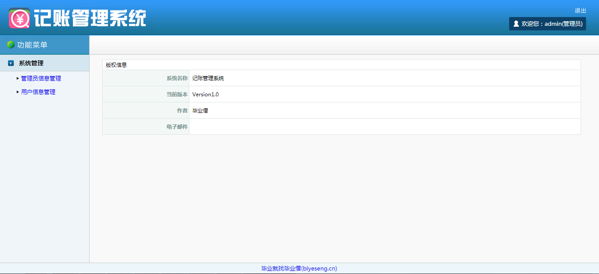
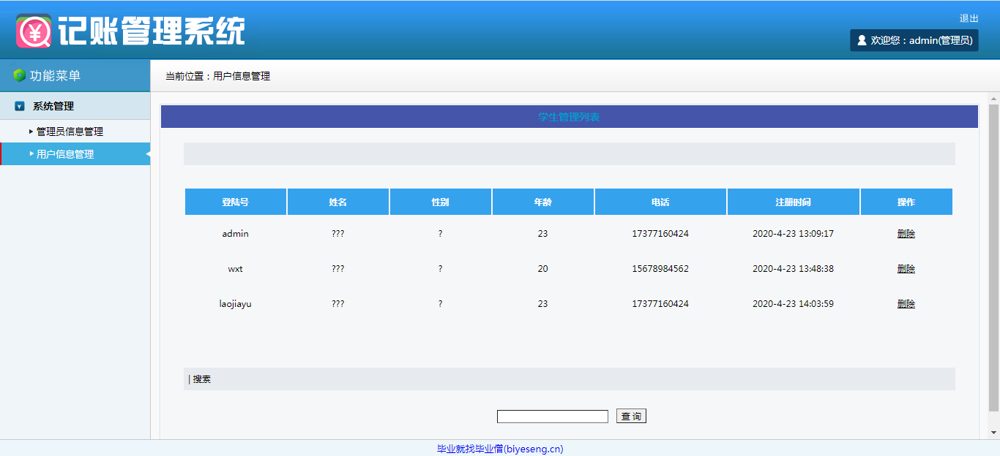
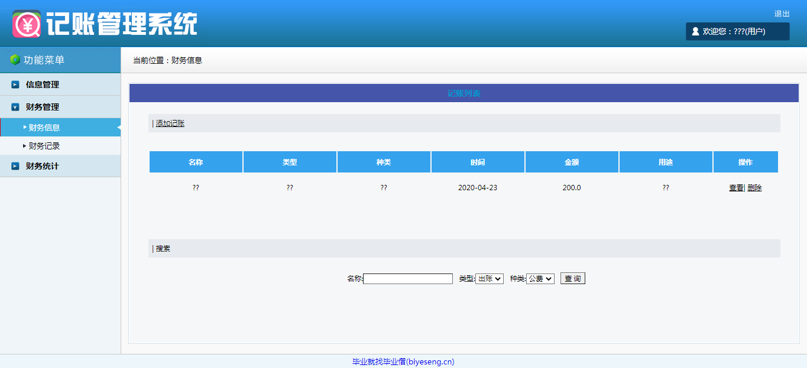

<h1 align="center">记账管理系统</h1>

## 简介
记账管理系统：角色分为管理员、用户；功能包括用户信息管理、管理员信息管理、信息管理、财务管理、财务统计，支持用户登录和注册。    --计算机毕业设计源码；毕设源码；java毕业设计源码

## 联系方式

<h3 align="center">获取完整代码与数据库文件 + 微信：bysj5151 QQ: 86050149 QQ群: 783742310</h3>

<h3 align="center">可帮忙远程部署 包运行成功！提供远程部署、修改代码、设计文档指导、代码讲解等服务！</h3>

## 功能介绍（完整见运行截图）
管理员： 基本功能包括登录、注销系统。管理员能够通过系统界面管理用户信息，包括查看、删除用户，配置系统用户和管理员的详细信息。左侧菜单提供管理员信息管理和用户信息管理选项，确保系统正常运行和安全使用。 用户： 可以通过系统的登录界面使用用户名和密码登录，完成后可查看和管理自己的财务信息。用户有权添加或查看账户记录，界面提供搜索功能以便查询特定记录，同时可以注销当前登录。

## 运行截图

本代码来源于网络,仅供学习参考使用!

